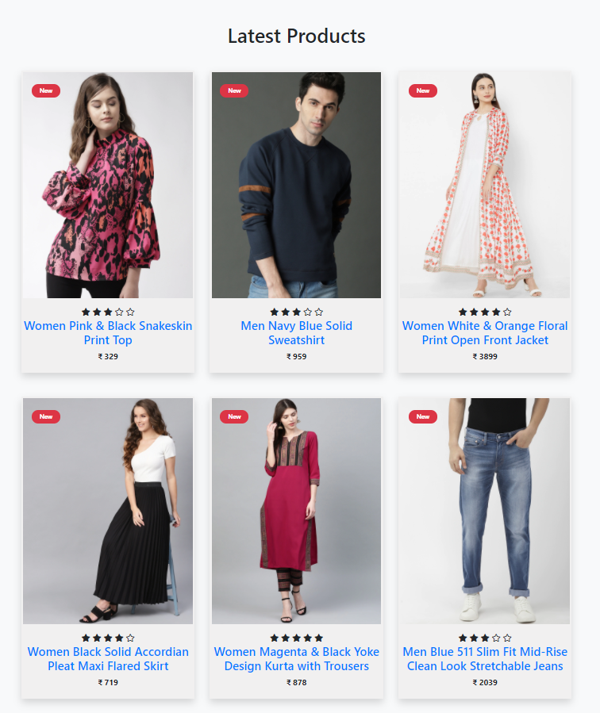

   

# Shoop.my 🛒

Shopp.my is an e-commerce website for clothing that allows you to buy and sell goods online.

## Pages

This website has following pages -

* Home
* Products
* Product view
* Category
* Cart
* Checkout
* Order Confirmation
* Search
* About Us
* Contact Us

## Details

* This website starts with the **home page** and then **product listing pages**.

* In short, **product listing pages (PLP)** are the results of either category pages or internal
search results. They play a huge role as a “catalog” because they actually display all products.
We have added category & price filter layout.

* A **product view page OR product details page (PDP)** is a web page on an eCommerce site
that presents the description of a specific product in view. The details displayed often
include size, color, price, shipping information, reviews, and other relevant information
customers may want to know before making a purchase.

* The **category page** is the one of the most important page website. This is the part where
you help narrow down options for people and guide them to their desired product page
so they make a purchase.
Just like browsing a supermarket, the easier it is to navigate and find desired products,
the easier it will be for people to buy things. The category page is like store aisles, get
them right and your customers will have a smooth shopping experience.

* A **cart page** is an essential part of an e-commerce website. It is the page where users can
pile up what they want to buy from the website.

* A **checkout page** is the page(s) related to payment and shipping/billing
details on an ecommerce store. The checkout page gives customers the opportunity to
complete their order.

* The order **confirmation page** is a page where customers land when they complete the
purchase. Its purpose is to confirm the success that the transaction went through
correctly and the order was placed.

* The **about us** page is commonly used by all types of businesses to give customers more
insight into who is involved with a given business and exactly what it does.
The primary purpose of an about us page is to inform the reader about the company
and its operations.

* The **contact us** page name itself is a call-to-action;
The goal of contact us page is to convert by clearly and effectively presenting the
method(s) of getting in touch with a company as quickly as possible.

* **Search page** is basically listing of results in response to query submitted by user.
Users can type the product number or product description into the search field and go
directly to that product, rather than needing to navigate the product categories to find
it.

## Screenshot

  

